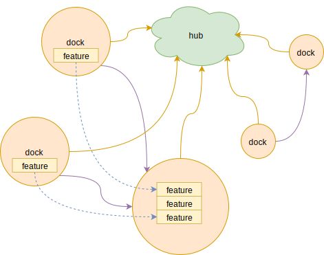

#  Ferry

[](https://travis-ci.com/muguangyi/ferry) [](https://godoc.org/github.com/muguangyi/ferry) [](https://codecov.io/gh/muguangyi/ferry) [](https://goreportcard.com/report/github.com/muguangyi/ferry)

> `NOTE`: Ferry is a **WIP** project, please `DO` `NOT` use it in your project so far.

**Ferry** is a lightweight server framework for `golang`. **Ferry** setup connections between containers based on `feature dependency`. This solution provides much flexibility for user to setup extendable servers quickly.

## What Ferry DO

**Ferry** is a server framework, and define the dev pattern to standalize server startup, connection and communicate flow. So user DO NOT need to write code for low level logic, like network connection, communicate protocol, etc, but only focus on the design and implementation for internal modules. It could make the modules more cohesive, decomposed, and general to improve the reusability.

## What Ferry DO NOT do

There is no `real` server implementation in **Ferry**, even no `log` module. Those featured modules will not be provided by **Ferry**, but need user to implement based on **Ferry** framework.

## Framework Diagram



## Tech Notes

* Feature container (dock) is an independent server node, and could contain many features.
* Every feature runs within an independent routine.
* Communication between features base on channel RPC (only support sync mode so far)
* Features in different docks could communicate through the same way (RPC based on `feature dependency`)

## Quick Start

### Required

|Go|`>=1.12.X`|
|--:|:--|
|GO111MODULE|`on`|

### $Install

```bash
go get github.com/muguangyi/ferry
```

### $Example: Print "Hello Ferry!"

This example will run **3** servers: `Hub`, `Logger` and `Game`.

#### Hub Server

```go
package main

import (
    "github.com/muguangyi/ferry"
)

func main() {
    // Call ferry.Serve to start a hub server.
    ferry.Serve("0.0.0.0:9999")
    ferry.Close()
}
```

#### Logger Server

Export `ILogger` interface with `Print` method.

```go
package main

import (
    "log"
    "github.com/muguangyi/ferry"
)

// ILogger expose to other features.
type ILogger interface {
    Print(msg string)
}

// logger compose ferry.Feature.
type logger struct{
    ferry.Feature
}

func (l *logger) Print(msg string) {
    log.Println(msg)
}

func main() {
    // Connect hub server with dock name and ILogger feature.
    ferry.Startup("127.0.0.1:9999", "logger",
        ferry.Carry("ILogger", &logger{}, true))
    ferry.Close()
}

```

#### Game Server

```go
package main

import (
    "github.com/muguangyi/ferry"
)

type IGame interface {
}

// game compose ferry.Feature
type game struct{
    ferry.Feature
}

// OnStart could start to fill logic code.
func (g *game) OnStart(s ferry.ISlot) {
    // Call ILogger Print function.
    s.Call("ILogger", "Print", "Hello Ferry!")
}

func main() {
    // Connect hub server with dock name and IGame feature.
    ferry.Startup("127.0.0.1:9999", "game",
        ferry.Carry("IGame", &game{}, true))
    ferry.Close()
}
```

> **Ferry** supports `code generation` to make DEV more convenient. More information refer to [Document](https://muguangyi.github.io/ferry.io/).

## Limitation (TBD)

Remember the methods on feature's export interface maybe be called through network, so `DO NOT` design method with **arbitrary** parameters, like callback function, pointer, etc.

## Document

[https://muguangyi.github.io/ferry.io/](https://muguangyi.github.io/ferry.io/)
